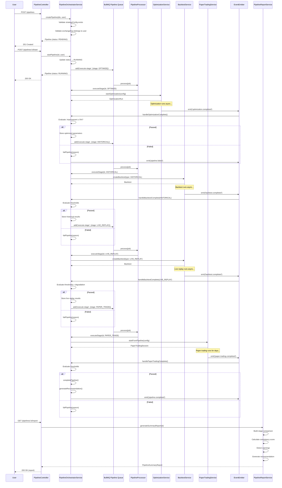
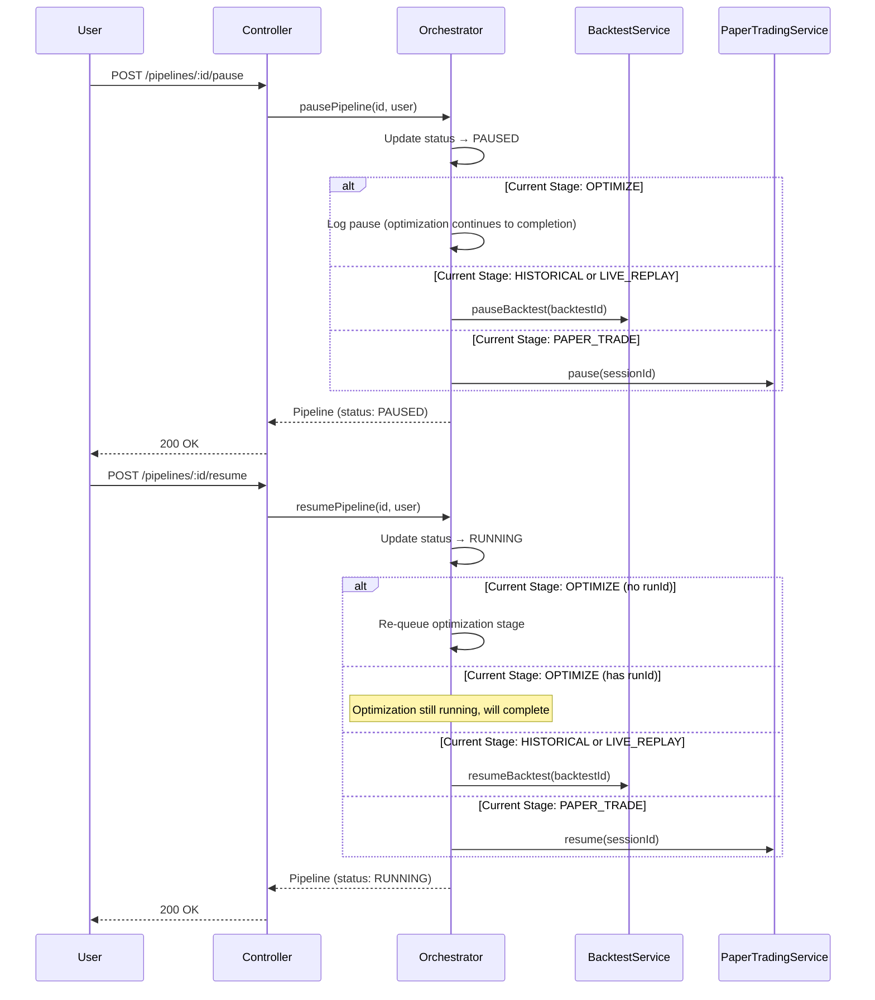
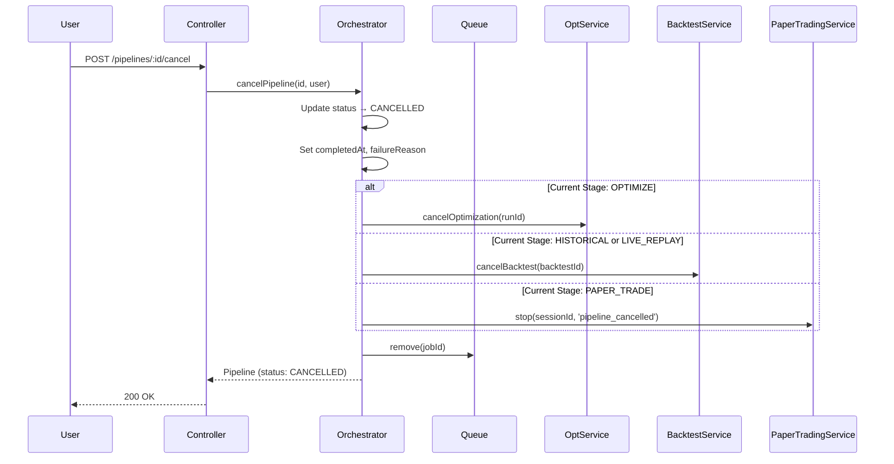
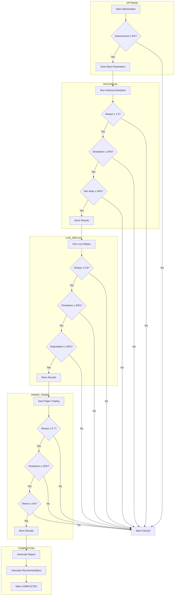
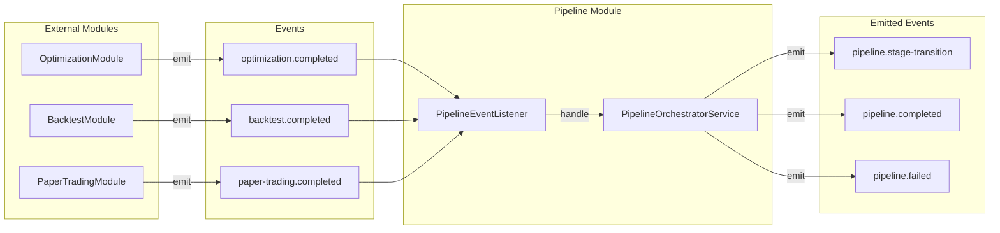
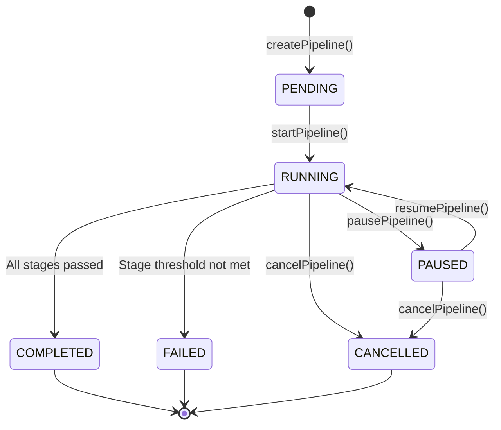

# Pipeline Stage Flow - Sequence Diagrams

This document illustrates the sequence of operations for the Strategy Development Pipeline.

## Complete Pipeline Flow

## Pause/Resume Flow

## Cancel Flow

## Stage Progression Logic

## Event Flow

## State Machine

## Notes

### Timeout Handling

- Each stage has implicit timeouts based on the underlying service
- Paper trading duration is configurable (`7d`, `14d`, etc.)
- If a stage doesn't complete, manual intervention may be required

### Idempotency

- Event handlers check pipeline status before processing
- Duplicate events are safely ignored
- Job IDs include timestamps to prevent BullMQ rejections

### Recovery

- Pipeline state is persisted in PostgreSQL
- BullMQ jobs are persisted in Redis
- After restart, pending jobs resume automatically

### Monitoring Points

1. Queue depth: `pipeline` queue in BullMQ dashboard
2. Stage duration: Compare `startedAt` with stage completion times
3. Failure rate: Count pipelines in FAILED status
4. Progression rate: Pipelines that pass each stage threshold
