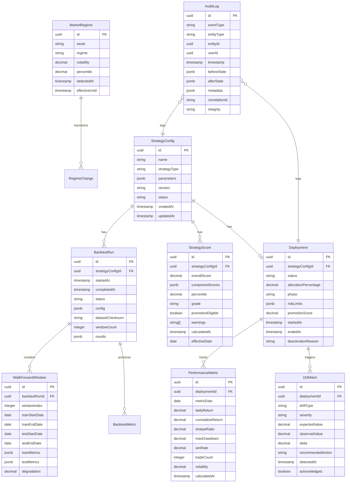

# Data Model: Automated Backtesting Orchestration

**Date**: 2025-10-28 **Feature**: Automated Backtesting Orchestration

## Entity Relationship Overview



## Core Entities

### 1. StrategyConfig

**Purpose**: Defines a unique trading strategy configuration with its parameters and version history.

**Fields**:

- `id`: UUID primary key
- `name`: Human-readable strategy name
- `strategyType`: Type of strategy (momentum, mean-reversion, arbitrage, etc.)
- `parameters`: JSON object containing all strategy parameters
- `version`: Semantic version for tracking changes
- `status`: Current status (draft, testing, validated, live, deprecated)
- `parentId`: Reference to parent strategy for version tracking (nullable)
- `createdBy`: User who created the strategy
- `createdAt`: Creation timestamp
- `updatedAt`: Last modification timestamp

**Relationships**:

- Has many BacktestRuns
- Has many StrategyScores
- Has zero or one Deployment
- Has many AuditLogs

**Validation Rules**:

- Name must be unique within active strategies
- Parameters must match strategy type schema
- Version must follow semantic versioning
- Status transitions must follow defined workflow

### 2. BacktestRun

**Purpose**: Records a complete backtesting execution including configuration and results.

**Fields**:

- `id`: UUID primary key
- `strategyConfigId`: Foreign key to StrategyConfig
- `startedAt`: Execution start timestamp
- `completedAt`: Execution completion timestamp (nullable)
- `status`: Run status (pending, running, completed, failed)
- `config`: Complete configuration used for the run
- `datasetChecksum`: SHA-256 hash of dataset for reproducibility
- `windowCount`: Number of walk-forward windows
- `results`: Aggregated results JSON
- `errorMessage`: Error details if failed (nullable)
- `executionTimeMs`: Total execution time in milliseconds

**Relationships**:

- Belongs to StrategyConfig
- Has many WalkForwardWindows
- Has many BacktestMetrics

**Validation Rules**:

- Dataset checksum must be valid SHA-256
- Window count must be >= 1
- Completed runs must have results

### 3. WalkForwardWindow

**Purpose**: Represents a single train/test window within a walk-forward analysis.

**Fields**:

- `id`: UUID primary key
- `backtestRunId`: Foreign key to BacktestRun
- `windowIndex`: Sequential window number
- `trainStartDate`: Training period start
- `trainEndDate`: Training period end
- `testStartDate`: Test period start
- `testEndDate`: Test period end
- `trainMetrics`: Training period performance metrics
- `testMetrics`: Test period performance metrics
- `degradation`: Percentage performance degradation from train to test

**Relationships**:

- Belongs to BacktestRun

**Validation Rules**:

- Train dates must precede test dates
- No overlap between train and test periods
- Window index must be sequential
- Degradation calculation must be documented

### 4. StrategyScore

**Purpose**: Comprehensive scoring and ranking of strategies based on multi-factor evaluation.

**Fields**:

- `id`: UUID primary key
- `strategyConfigId`: Foreign key to StrategyConfig
- `overallScore`: Weighted composite score (0-100)
- `componentScores`: Individual metric scores JSON
- `percentile`: Rank percentile among all strategies
- `grade`: Letter grade (A-F)
- `promotionEligible`: Boolean flag for promotion readiness
- `warnings`: Array of warning messages
- `calculatedAt`: Calculation timestamp
- `effectiveDate`: Date for which score is valid
- `backtestRunIds`: Array of BacktestRun IDs used

**Relationships**:

- Belongs to StrategyConfig

**Validation Rules**:

- Overall score must be 0-100
- Component scores must sum to overall score with weights
- Grade must match score ranges
- Warnings must be actionable

### 5. Deployment

**Purpose**: Tracks live trading deployment of a strategy with allocation and risk limits.

**Fields**:

- `id`: UUID primary key
- `strategyConfigId`: Foreign key to StrategyConfig
- `status`: Deployment status (active, paused, deactivated)
- `allocationPercentage`: Percentage of capital allocated
- `phase`: Deployment phase (initial, growth, full)
- `riskLimits`: JSON object with risk parameters
- `promotionScore`: Score at time of promotion
- `promotionUserId`: User who approved promotion
- `startedAt`: Deployment start timestamp
- `endedAt`: Deployment end timestamp (nullable)
- `pausedUntil`: Temporary pause expiry (nullable)
- `deactivationReason`: Reason for deactivation (nullable)
- `totalCapital`: Total capital at deployment

**Relationships**:

- Belongs to StrategyConfig
- Has many PerformanceMetrics
- Has many DriftAlerts

**Validation Rules**:

- Only one active deployment per strategy
- Allocation must be 0.01-100%
- Risk limits must include all required fields
- Phase transitions must be sequential

### 6. PerformanceMetric

**Purpose**: Daily performance tracking for live deployments.

**Fields**:

- `id`: UUID primary key
- `deploymentId`: Foreign key to Deployment
- `metricDate`: Date of metrics
- `dailyReturn`: Daily return percentage
- `cumulativeReturn`: Cumulative return since deployment
- `sharpeRatio`: Rolling 30-day Sharpe ratio
- `maxDrawdown`: Maximum drawdown to date
- `winRate`: Win rate percentage
- `tradeCount`: Number of trades executed
- `volatility`: Annualized volatility
- `benchmarkReturn`: Benchmark return for comparison
- `calculatedAt`: Calculation timestamp

**Relationships**:

- Belongs to Deployment

**Validation Rules**:

- One record per deployment per day
- Metrics must be internally consistent
- Cumulative return must match daily returns

### 7. MarketRegime

**Purpose**: Tracks detected market regimes based on volatility percentiles.

**Fields**:

- `id`: UUID primary key
- `asset`: Asset symbol (BTC, ETH, etc.)
- `regime`: Regime classification (low_volatility, normal, high_volatility, extreme)
- `volatility`: Realized volatility value
- `percentile`: Volatility percentile (0-100)
- `detectedAt`: Detection timestamp
- `effectiveUntil`: End of regime period (nullable)
- `previousRegimeId`: Reference to previous regime (nullable)

**Relationships**:

- Has many RegimeChanges

**Validation Rules**:

- Regime must match percentile ranges
- Percentile must be 0-100
- Asset must be valid symbol

### 8. DriftAlert

**Purpose**: Records performance drift detection events and recommended actions.

**Fields**:

- `id`: UUID primary key
- `deploymentId`: Foreign key to Deployment
- `strategyId`: Foreign key to StrategyConfig
- `driftType`: Type of drift (sharpe, return, drawdown, winrate, volatility)
- `severity`: Alert severity (warning, critical)
- `expectedValue`: Expected metric value from backtest
- `observedValue`: Actual observed value
- `delta`: Percentage difference
- `recommendedAction`: System recommendation (monitor, reduce_allocation, deactivate)
- `detectedAt`: Detection timestamp
- `acknowledged`: Boolean for user acknowledgment
- `acknowledgedBy`: User who acknowledged (nullable)
- `actionTaken`: Actual action taken (nullable)

**Relationships**:

- Belongs to Deployment

**Validation Rules**:

- Delta must match calculation from expected/observed
- Severity must align with drift thresholds
- Recommended action must be valid option

### 9. AuditLog

**Purpose**: Immutable audit trail for all system decisions and changes.

**Fields**:

- `id`: UUID primary key
- `eventType`: Type of event (see enum)
- `entityType`: Entity type (strategy, deployment, etc.)
- `entityId`: ID of affected entity
- `userId`: User who triggered event (nullable for system)
- `timestamp`: Event timestamp
- `beforeState`: State before change (JSON, nullable)
- `afterState`: State after change (JSON, nullable)
- `metadata`: Additional event metadata (JSON)
- `correlationId`: ID linking related events
- `integrity`: SHA-256 hash for tamper detection
- `ipAddress`: Client IP address (nullable)
- `userAgent`: Client user agent (nullable)

**Relationships**:

- Polymorphic relationship to any entity

**Validation Rules**:

- Integrity hash must be valid
- Timestamp must be immutable
- Event type must be from defined enum
- No updates allowed after creation

## State Transitions

### Strategy Status Workflow

```
draft → testing → validated → live → deprecated
         ↓          ↓           ↓
      failed    rejected   deactivated
```

### Deployment Status Workflow

```
active → paused → active
   ↓        ↓
deactivated deactivated
```

### Deployment Phase Progression

```
initial (1-2%) → growth (3-5%) → full (5-10%)
      ↓               ↓              ↓
  deactivated    deactivated    deactivated
```

## Indexes and Performance

### Primary Indexes

```sql
-- StrategyConfig
CREATE INDEX idx_strategy_status ON strategy_configs(status);
CREATE INDEX idx_strategy_type ON strategy_configs(strategy_type);

-- BacktestRun
CREATE INDEX idx_backtest_strategy ON backtest_runs(strategy_config_id, created_at DESC);
CREATE INDEX idx_backtest_status ON backtest_runs(status);

-- StrategyScore
CREATE INDEX idx_score_strategy ON strategy_scores(strategy_config_id, effective_date DESC);
CREATE INDEX idx_score_percentile ON strategy_scores(percentile DESC);

-- Deployment
CREATE INDEX idx_deployment_status ON deployments(status);
CREATE INDEX idx_deployment_strategy ON deployments(strategy_config_id);

-- PerformanceMetric
CREATE INDEX idx_performance_deployment ON performance_metrics(deployment_id, metric_date DESC);

-- MarketRegime
CREATE INDEX idx_regime_asset ON market_regimes(asset, detected_at DESC);

-- DriftAlert
CREATE INDEX idx_drift_deployment ON drift_alerts(deployment_id, detected_at DESC);
CREATE INDEX idx_drift_severity ON drift_alerts(severity, acknowledged);

-- AuditLog (partitioned by month)
CREATE INDEX idx_audit_entity ON audit_logs(entity_type, entity_id, timestamp DESC);
CREATE INDEX idx_audit_event ON audit_logs(event_type, timestamp DESC);
CREATE INDEX idx_audit_correlation ON audit_logs(correlation_id);
```

### Materialized Views

```sql
-- Strategy performance summary
CREATE MATERIALIZED VIEW strategy_performance_summary AS
SELECT
    s.id,
    s.name,
    COUNT(DISTINCT br.id) as backtest_count,
    AVG(ss.overall_score) as avg_score,
    MAX(ss.percentile) as best_percentile,
    d.status as deployment_status,
    d.allocation_percentage
FROM strategy_configs s
LEFT JOIN backtest_runs br ON s.id = br.strategy_config_id
LEFT JOIN strategy_scores ss ON s.id = ss.strategy_config_id
LEFT JOIN deployments d ON s.id = d.strategy_config_id
GROUP BY s.id, s.name, d.status, d.allocation_percentage;

-- Daily portfolio performance
CREATE MATERIALIZED VIEW portfolio_daily_performance AS
SELECT
    pm.metric_date,
    SUM(pm.daily_return * d.allocation_percentage / 100) as portfolio_return,
    AVG(pm.sharpe_ratio) as avg_sharpe,
    MAX(pm.max_drawdown) as max_drawdown,
    COUNT(DISTINCT d.id) as active_strategies
FROM performance_metrics pm
JOIN deployments d ON pm.deployment_id = d.id
WHERE d.status = 'active'
GROUP BY pm.metric_date;
```

## Data Retention Policies

| Entity            | Retention Period | Archival Strategy                           |
| ----------------- | ---------------- | ------------------------------------------- |
| StrategyConfig    | Indefinite       | Active in primary DB                        |
| BacktestRun       | 2 years          | Archive to S3 after 2 years                 |
| WalkForwardWindow | 2 years          | Archive with BacktestRun                    |
| StrategyScore     | 1 year           | Archive to S3 after 1 year                  |
| Deployment        | Indefinite       | Active in primary DB                        |
| PerformanceMetric | 2 years          | Partition by month, archive after 2 years   |
| MarketRegime      | 5 years          | Partition by year                           |
| DriftAlert        | 2 years          | Archive to S3 after 2 years                 |
| AuditLog          | 5 years minimum  | Partition by month, archive to cold storage |

## Security Considerations

1. **Encryption at Rest**
   - Strategy parameters encrypted using AES-256
   - Sensitive metadata in audit logs encrypted
   - Database transparent encryption enabled

2. **Access Control**
   - Row-level security on Deployment table
   - Role-based access to StrategyConfig
   - Audit logs read-only except for inserts

3. **Data Integrity**
   - SHA-256 checksums on datasets
   - Cryptographic hashing of audit entries
   - Foreign key constraints enforced

4. **PII Protection**
   - User IDs pseudonymized in exports
   - IP addresses hashed in audit logs
   - No sensitive data in metric calculations
