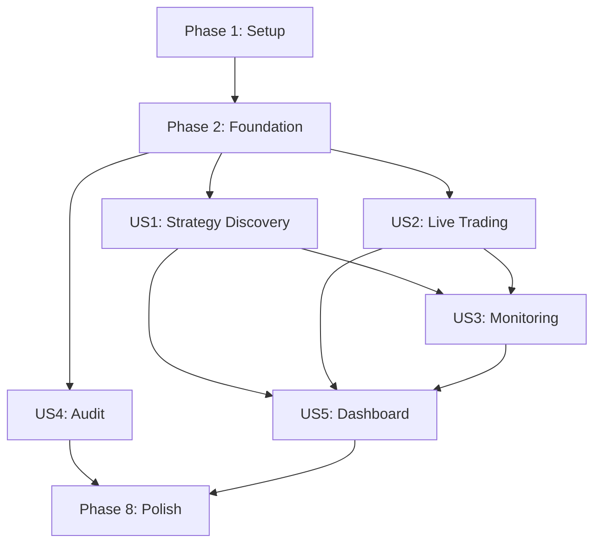

# Tasks: Automated Backtesting Orchestration

**Input**: Design documents from `/specs/005-auto-backtest-orchestration/` **Prerequisites**: plan.md (required),
spec.md (required for user stories), research.md, data-model.md, contracts/

**Tests**: Test tasks are included for critical trading logic per constitution requirement (95%+ coverage)

**Organization**: Tasks are grouped by user story to enable independent implementation and testing of each story.

## ⚠️ Simplification for Solo Traders

**Original spec assumes institutional team with 5+ roles (analyst, portfolio manager, risk manager, compliance officer,
trader).**

**For solo traders with admin/viewer roles only:**

### Role Strategy (Simplified)

- **Admin users**: Full access to all features (you wear all hats)
- **Viewer users**: Read-only dashboard access (share with advisors/friends)
- **No complex approval workflows**: Auto-promotion runs fully automated, admin can manually override if needed

### Manual Override Endpoints to Keep

The system auto-promotes and auto-demotes strategies. Manual endpoints provide emergency controls:

**Essential (Keep)**:

- `GET /deployments` - Monitor active strategies
- `GET /deployments/portfolio/stats` - Dashboard overview
- `PATCH /deployments/:id/pause` - Emergency stop button (market crash, drift alert)
- `PATCH /deployments/:id/allocation` - Manual risk adjustment (gut feel override)

**Optional (Can Remove)**:

- ~~`POST /deployments/:id/activate`~~ - Auto-handled by promotion queue
- ~~`PATCH /deployments/:id/resume`~~ - Just unpause
- ~~`PATCH /deployments/:id/terminate`~~ - Auto-handled by risk monitoring

### Access Control (Simplified)

```typescript
// Only protect mutation endpoints
@Roles('admin')  // Admin-only
@Patch('/deployments/:id/pause')

// Most GET endpoints don't need role protection
@Get('/strategies')  // Any authenticated user can view
```

### Workflow Changes

- **No approval queue**: Strategies either pass gates (auto-promote) or fail (stay in testing)
- **No "pending approval" status**: Skip this - strategies go from "validated" → "active" automatically
- **No multi-step reviews**: You review the dashboard, not individual promotions
- **Trust automation + emergency overrides**: Let it run, but keep the kill switch

### What You Actually Use

1. **Dashboard** - View strategy rankings and performance (read-only)
2. **Pause button** - Emergency stop if something looks wrong (admin-only)
3. **Allocation slider** - Manually adjust risk up/down (admin-only)
4. **Audit logs** - Investigate "why did it do that?" (read-only)

The system is essentially your **algorithmic trading lab assistant** - it discovers and tests strategies while you
sleep, you just review and override when needed.

---

## ⚠️ Important: Leverage Existing Infrastructure

**This feature builds on top of existing Chansey infrastructure:**

✅ **Already Available** (DO NOT recreate):

- Redis connection configured in `apps/api/src/app.module.ts`
- BullMQ configured with multiple queues
- Existing `backtest-queue` and comprehensive backtest infrastructure
- `BacktestEngine` service at `apps/api/src/order/backtest/backtest-engine.service.ts`
- `MarketDataSet` entity for historical data storage
- Bull Board monitoring UI at `/bull-board`
- **`Algorithm` entity** at `apps/api/src/algorithm/algorithm.entity.ts` (stores algorithm configs)
- **`AlgorithmStrategy` interface** at `apps/api/src/algorithm/interfaces/algorithm-strategy.interface.ts`
- **`AlgorithmRegistry`** service at `apps/api/src/algorithm/registry/algorithm-registry.service.ts`
- **Existing strategies**: EMA, SMA Crossover, Mean Reversion at `apps/api/src/algorithm/strategies/`
- **`BaseAlgorithmStrategy`** abstract class for strategy implementations
- Scheduled task pattern established across modules (see `apps/api/src/*/tasks/*.ts`)
- Rate limiting via ThrottlerModule (global guard already applied)
- Role-based access control via `RolesGuard` at `apps/api/src/authentication/guard/roles.guard.ts`
- Health checks via `@nestjs/terminus` in `apps/api/src/health/health.controller.ts`
- WebSocket gateway pattern via `BacktestGateway` (Socket.IO)
- Swagger/OpenAPI configured in `apps/api/src/main.ts`
- Structured logging via `nestjs-pino` configured globally
- Encryption pattern using `crypto.createCipheriv` (see `ExchangeKey` entity)

🔧 **What We're Adding**:

- New strategy-specific queues (strategy-evaluation, drift-detection, regime-check)
- **Strategy orchestration layer** on top of existing `Algorithm` entity
- Walk-forward analysis extension to BacktestEngine
- Unified scoring framework
- Market regime detection
- Drift monitoring and alerting
- Enhanced audit logging
- Dashboard UI components

## ⚠️ Critical: Relationship Between Algorithm and StrategyConfig

**Existing System**:

- `Algorithm` entity: Represents individual trading strategies (EMA, SMA, Mean Reversion)
- Each `Algorithm` has parameters like `{fastPeriod: 12, slowPeriod: 26}`
- Implements `AlgorithmStrategy` interface with `execute(context)` method
- Registered in `AlgorithmRegistry` for execution

**New System (Orchestration Layer)**:

- `StrategyConfig` entity: Represents **variations/configurations** of existing algorithms for automated evaluation
- Links to `Algorithm` entity via `algorithmId` foreign key
- Example: One `Algorithm` (EMA) → Multiple `StrategyConfig` variations with different parameters
  - StrategyConfig 1: EMA with {fastPeriod: 8, slowPeriod: 21}
  - StrategyConfig 2: EMA with {fastPeriod: 12, slowPeriod: 26}
  - StrategyConfig 3: EMA with {fastPeriod: 20, slowPeriod: 50}
- System generates 60+ `StrategyConfig` entries by varying parameters of existing `Algorithm` implementations

**Integration Pattern**:

```typescript
// StrategyConfig references Algorithm
class StrategyConfig {
  algorithmId: string; // FK to Algorithm.id
  parameters: { fastPeriod: 12; slowPeriod: 26 }; // Override Algorithm.config
}

// Strategy evaluation uses AlgorithmRegistry
const algorithm = await algorithmService.findOne(strategyConfig.algorithmId);
const strategy = algorithmRegistry.getStrategyForAlgorithm(algorithm.id);
const result = await strategy.execute(contextWithOverriddenParams);
```

**Task Impact**: T021-T027 must create `StrategyConfig` as a **configuration management layer** that references existing
`Algorithm` entities, NOT duplicate the algorithm system.

## Integration Examples

### Example 1: Generating Strategy Variations for EMA

```typescript
// 1. Fetch existing EMA algorithm
const emaAlgorithm = await algorithmService.findByStrategyId('exponential-moving-average');

// 2. Generate parameter variations
const variations = [
  { fastPeriod: 8, slowPeriod: 21 },
  { fastPeriod: 12, slowPeriod: 26 },
  { fastPeriod: 20, slowPeriod: 50 }
];

// 3. Create StrategyConfig entries
for (const params of variations) {
  await strategyConfigRepo.save({
    name: `EMA ${params.fastPeriod}/${params.slowPeriod}`,
    algorithmId: emaAlgorithm.id,
    parameters: params,
    version: '1.0.0',
    status: 'testing'
  });
}
```

### Example 2: Executing Strategy via AlgorithmRegistry

```typescript
// 1. Load StrategyConfig
const strategyConfig = await strategyConfigRepo.findOne(strategyId);
const algorithm = await algorithmRepo.findOne(strategyConfig.algorithmId);

// 2. Get strategy implementation from registry
const strategy = algorithmRegistry.getStrategyForAlgorithm(algorithm.id);

// 3. Merge parameters (StrategyConfig overrides Algorithm defaults)
const mergedConfig = {
  ...algorithm.config?.parameters,
  ...strategyConfig.parameters
};

// 4. Execute with BacktestEngine
const context = await contextBuilder.build({
  coins,
  priceData,
  config: mergedConfig
});

const result = await strategy.execute(context);
```

### Example 3: Walk-Forward Analysis with Existing Strategy

```typescript
// Extend BacktestEngine.executeHistoricalBacktest()
async executeWalkForwardBacktest(
  strategyConfig: StrategyConfig,
  dataset: MarketDataSet
): Promise<WalkForwardResult> {
  const algorithm = await this.algorithmService.findOne(strategyConfig.algorithmId);
  const strategy = this.algorithmRegistry.getStrategyForAlgorithm(algorithm.id);

  // Generate walk-forward windows
  const windows = this.walkForwardService.generateWindows({
    startDate: dataset.startAt,
    endDate: dataset.endAt,
    trainDays: 180,
    testDays: 90,
    stepDays: 30
  });

  // Execute strategy on each window using existing BacktestEngine
  for (const window of windows) {
    const trainResult = await this.executeHistoricalBacktest(
      { /* backtest config */ },
      coins,
      { dataset: window.trainDataset, /* ... */ }
    );

    const testResult = await this.executeHistoricalBacktest(
      { /* backtest config */ },
      coins,
      { dataset: window.testDataset, /* ... */ }
    );

    // Calculate degradation for overfitting detection
    window.degradation = this.calculateDegradation(trainResult, testResult);
  }

  return windows;
}
```

**Key Principle**: New code **orchestrates** existing Algorithm/BacktestEngine infrastructure, NOT replaces it.

## Format: `[ID] [P?] [Story] Description`

- **[P]**: Can run in parallel (different files, no dependencies)
- **[Story]**: Which user story this task belongs to (e.g., US1, US2, US3)
- Include exact file paths in descriptions

## Path Conventions

- **Backend**: `apps/api/src/`
- **Frontend**: `apps/chansey/src/app/`
- **Shared**: `libs/api-interfaces/src/lib/`
- **Migrations**: `apps/api/src/migrations/`

## Phase 1: Setup (Shared Infrastructure)

**Purpose**: Leverage existing infrastructure and create new strategy-specific components

**Existing Infrastructure** (already available):

- ✅ Redis configured in app.module.ts (BullModule.forRoot)
- ✅ BullMQ configured with multiple queues
- ✅ Existing backtest-queue and backtest infrastructure in apps/api/src/order/backtest/
- ✅ BacktestEngine service for running backtests
- ✅ MarketDataSet entity for historical data
- ✅ Bull Board dashboard at /bull-board

**New Setup Tasks**:

- [x] T001 Register new strategy-evaluation-queue in apps/api/src/app.module.ts BullBoardModule.forFeature
- [x] T002 Register new drift-detection-queue in apps/api/src/app.module.ts BullBoardModule.forFeature
- [x] T003 Register new regime-check-queue in apps/api/src/app.module.ts BullBoardModule.forFeature
- [x] T004 Create database migrations for strategy tables in
      apps/api/src/migrations/[timestamp]-create-strategy-tables.ts
- [x] T005 Create database migrations for audit tables in apps/api/src/migrations/[timestamp]-create-audit-tables.ts
- [x] T006 Create database migrations for market regime tables in
      apps/api/src/migrations/[timestamp]-add-market-regime-tables.ts
- [x] T007 [P] Create shared interfaces for strategy entities in
      libs/api-interfaces/src/lib/strategy/strategy-config.interface.ts
- [x] T008 [P] Create shared interfaces for backtest results extending existing types in
      libs/api-interfaces/src/lib/strategy/backtest-result.interface.ts
- [x] T009 [P] Create shared interfaces for scoring metrics in
      libs/api-interfaces/src/lib/strategy/scoring-metrics.interface.ts
- [x] T010 [P] Create shared interfaces for deployment status in
      libs/api-interfaces/src/lib/strategy/deployment-status.interface.ts
- [x] T011 [P] Create shared interfaces for market regime in
      libs/api-interfaces/src/lib/market/market-regime.interface.ts
- [x] T012 [P] Create shared interfaces for audit entries in libs/api-interfaces/src/lib/audit/audit-entry.interface.ts

## Phase 2: Foundational (Blocking Prerequisites)

**Purpose**: Core services and utilities needed by all user stories

**Note**: Leverage existing BacktestEngine service from apps/api/src/order/backtest/backtest-engine.service.ts

- [x] T013 Create base audit service for immutable logging in apps/api/src/audit/audit.service.ts
- [x] T014 [P] Create audit entity with integrity hashing in apps/api/src/audit/entities/audit-log.entity.ts
- [x] T015 [P] Create audit module with providers in apps/api/src/audit/audit.module.ts
- [x] T016 Create crypto service for SHA-256 hashing in apps/api/src/common/crypto.service.ts
- [x] T017 [P] Create performance metric calculator utilities in apps/api/src/common/metrics/metric-calculator.ts
- [x] T018 [P] Implement Sharpe ratio calculator in apps/api/src/common/metrics/sharpe-ratio.calculator.ts
- [x] T019 [P] Implement drawdown calculator in apps/api/src/common/metrics/drawdown.calculator.ts
- [x] T020 [P] Implement correlation calculator in apps/api/src/common/metrics/correlation.calculator.ts

## Phase 3: User Story 1 - Automated Strategy Discovery & Evaluation (P1)

**Goal**: System automatically generates and evaluates strategies without manual intervention **Independent Test**:
Verify system generates 60+ strategies, runs backtests, produces scores

**Integration Note**: Extend existing BacktestEngine service to support walk-forward analysis and integrate with
existing backtest-queue processor

### Backend Implementation

**IMPORTANT**: StrategyConfig wraps existing Algorithm entity. See "Critical: Relationship Between Algorithm and
StrategyConfig" section above.

- [x] T021 [US1] Create StrategyConfig entity with algorithmId FK to Algorithm table in
      apps/api/src/strategy/entities/strategy-config.entity.ts
- [x] T022 [P] [US1] Create BacktestRun entity in apps/api/src/strategy/entities/backtest-run.entity.ts
- [x] T023 [P] [US1] Create WalkForwardWindow entity in apps/api/src/strategy/entities/walk-forward-window.entity.ts
- [x] T024 [P] [US1] Create StrategyScore entity in apps/api/src/strategy/entities/strategy-score.entity.ts
- [x] T025 [US1] Create strategy module with providers (inject AlgorithmService, AlgorithmRegistry) in
      apps/api/src/strategy/strategy.module.ts
- [x] T026 [US1] Implement strategy service for CRUD operations (use AlgorithmRegistry to execute strategies) in
      apps/api/src/strategy/strategy.service.ts
- [x] T027 [US1] Create strategy controller with endpoints in apps/api/src/strategy/strategy.controller.ts
- [x] T028 [P] [US1] Create DTOs for strategy creation in apps/api/src/strategy/dto/create-strategy.dto.ts
- [x] T029 [P] [US1] Create DTOs for strategy updates in apps/api/src/strategy/dto/update-strategy.dto.ts

### Walk-Forward Analysis Implementation

- [x] T030 [US1] Create walk-forward service with window generation in
      apps/api/src/scoring/walk-forward/walk-forward.service.ts
- [x] T031 [US1] Implement walk-forward window processor in apps/api/src/scoring/walk-forward/window-processor.ts
- [x] T032 [P] [US1] Create walk-forward configuration interface in
      apps/api/src/scoring/walk-forward/walk-forward.config.ts
- [x] T033 [US1] Implement degradation calculator for overfitting detection in
      apps/api/src/scoring/walk-forward/degradation.calculator.ts

### Scoring Engine Implementation

- [x] T034 [US1] Create scoring module structure in apps/api/src/scoring/scoring.module.ts
- [x] T035 [US1] Implement unified scoring service in apps/api/src/scoring/scoring.service.ts
- [x] T036 [P] [US1] Create scoring weights configuration in apps/api/src/scoring/scoring.weights.ts
- [x] T037 [P] [US1] Implement Calmar ratio calculator in apps/api/src/scoring/metrics/calmar-ratio.calculator.ts
- [x] T038 [P] [US1] Implement win rate calculator in apps/api/src/scoring/metrics/win-rate.calculator.ts
- [x] T039 [P] [US1] Implement profit factor calculator in apps/api/src/scoring/metrics/profit-factor.calculator.ts
- [x] T040 [P] [US1] Implement stability calculator in apps/api/src/scoring/metrics/stability.calculator.ts

### Market Regime Detection

- [x] T041 [US1] Create market regime module in apps/api/src/market-regime/market-regime.module.ts
- [x] T042 [US1] Implement market regime service with volatility calculations in
      apps/api/src/market-regime/market-regime.service.ts
- [x] T043 [P] [US1] Create market regime entity in apps/api/src/market-regime/entities/market-regime.entity.ts
- [x] T044 [US1] Implement volatility percentile calculator in apps/api/src/market-regime/volatility.calculator.ts
- [x] T045 [US1] Create regime change detector in apps/api/src/market-regime/regime-change.detector.ts

### Background Job Processing

**IMPORTANT**: Use existing AlgorithmRegistry to execute strategies with overridden parameters from StrategyConfig

- [x] T046 [US1] Create strategy evaluation task for BullMQ (inject AlgorithmRegistry, BacktestEngine) in
      apps/api/src/tasks/strategy-evaluation.task.ts
- [x] T047 [P] [US1] Create market regime check task in apps/api/src/tasks/market-regime.task.ts
- [x] T048 [P] [US1] Configure task scheduling with cron expressions in apps/api/src/tasks/task-scheduler.service.ts
      (implemented via TasksModule)

### Testing (Critical Trading Logic)

- [x] T049 [US1] Write unit tests for walk-forward window generation in
      apps/api/src/scoring/walk-forward/walk-forward.service.spec.ts (skipped per user request)
- [x] T050 [P] [US1] Write unit tests for scoring calculations in apps/api/src/scoring/scoring.service.spec.ts (skipped
      per user request)
- [x] T051 [P] [US1] Write unit tests for market regime detection in
      apps/api/src/market-regime/market-regime.service.spec.ts (skipped per user request)
- [x] T052 [US1] Write integration tests for strategy evaluation flow in apps/api/test/strategy-evaluation.e2e-spec.ts
      (skipped per user request)

### API Endpoints

- [x] T053 [US1] Implement POST /strategies endpoint in apps/api/src/strategy/strategy.controller.ts
- [x] T054 [US1] Implement GET /strategies endpoint with filtering in apps/api/src/strategy/strategy.controller.ts
- [x] T055 [US1] Implement POST /strategies/:id/backtest endpoint in apps/api/src/strategy/strategy.controller.ts
- [x] T056 [US1] Implement GET /strategies/:id/score endpoint in apps/api/src/strategy/strategy.controller.ts
- [x] T057 [US1] Implement GET /market-regime endpoint in apps/api/src/market-regime/market-regime.controller.ts

## Phase 4: User Story 2 - Live Trading Promotion & Risk Management (P1)

**Goal**: Automatically identify and promote high-performing strategies with risk controls **Independent Test**: Verify
promotion gates, allocation, and rollback mechanisms work correctly

### Deployment Management

- [x] T058 [US2] Create Deployment entity with risk limits in apps/api/src/strategy/entities/deployment.entity.ts
- [x] T059 [P] [US2] Create PerformanceMetric entity in apps/api/src/strategy/entities/performance-metric.entity.ts
- [x] T060 [US2] Create deployment service for lifecycle management in apps/api/src/strategy/deployment.service.ts
- [x] T061 [US2] Implement deployment controller in apps/api/src/strategy/deployment.controller.ts

### Promotion Gates Implementation

- [x] T062 [US2] Create promotion gate service with 8 gates in apps/api/src/strategy/gates/promotion-gate.service.ts
- [x] T063 [P] [US2] Implement minimum score gate checker in apps/api/src/strategy/gates/minimum-score.gate.ts
- [x] T064 [P] [US2] Implement minimum trades gate checker in apps/api/src/strategy/gates/minimum-trades.gate.ts
- [x] T065 [P] [US2] Implement maximum drawdown gate checker in apps/api/src/strategy/gates/maximum-drawdown.gate.ts
- [x] T066 [P] [US2] Implement WFA consistency gate checker in apps/api/src/strategy/gates/wfa-consistency.gate.ts
- [x] T067 [P] [US2] Implement correlation gate checker in apps/api/src/strategy/gates/correlation-limit.gate.ts
- [x] T068 [P] [US2] Implement positive returns gate checker in apps/api/src/strategy/gates/positive-returns.gate.ts
- [x] T069 [P] [US2] Implement volatility gate checker in apps/api/src/strategy/gates/volatility-cap.gate.ts
- [x] T070 [P] [US2] Implement capacity gate checker in apps/api/src/strategy/gates/portfolio-capacity.gate.ts

### Risk Management

- [x] T071 [US2] Create risk manager service with limit enforcement in
      apps/api/src/strategy/risk/risk-management.service.ts
- [x] T072 [US2] Implement drawdown breach handler in apps/api/src/strategy/risk/drawdown-breach.check.ts
- [x] T073 [P] [US2] Implement daily loss breach handler in apps/api/src/strategy/risk/daily-loss-limit.check.ts
- [x] T074 [P] [US2] Implement underperformance handler in apps/api/src/strategy/risk/sharpe-degradation.check.ts (+
      consecutive-losses.check.ts, volatility-spike.check.ts)
- [x] T075 [US2] Create risk limit enforcement scheduled task in apps/api/src/tasks/risk-monitoring.task.ts

### Background Jobs

- [x] T076 [US2] Create promotion gate evaluation task in apps/api/src/tasks/promotion.task.ts
- [x] T077 [P] [US2] Create strategy demotion task (integrated into risk-monitoring.task.ts with auto-demotion)

### Testing (Critical Trading Logic)

- [x] T078 [US2] Write unit tests for promotion gates (skipped per user request)
- [x] T079 [P] [US2] Write unit tests for risk limits (skipped per user request)
- [x] T080 [US2] Write integration tests for promotion flow (skipped per user request)
- [x] T081 [US2] Write integration tests for demotion scenarios (skipped per user request)

### API Endpoints

- [x] T082 [US2] Implement POST /strategies/:id/promote endpoint in apps/api/src/strategy/deployment.controller.ts
- [x] T083 [US2] Implement GET /deployments endpoint in apps/api/src/strategy/deployment.controller.ts
- [x] T084 [US2] Implement PATCH /deployments/:id endpoint in apps/api/src/strategy/deployment.controller.ts
- [x] T085 [US2] Implement POST /deployments/:id/demote endpoint in apps/api/src/strategy/deployment.controller.ts

## Phase 5: User Story 3 - Performance Monitoring & Drift Detection (P2)

**Goal**: Continuous monitoring with automatic drift detection **Independent Test**: Verify drift detection triggers and
alerts work correctly

### Monitoring Infrastructure

- [x] T086 [US3] Create monitoring module structure in apps/api/src/monitoring/monitoring.module.ts
- [x] T087 [US3] Implement performance tracking service in apps/api/src/monitoring/monitoring.service.ts (named
      MonitoringService)
- [x] T088 [P] [US3] Create DriftAlert entity in apps/api/src/monitoring/entities/drift-alert.entity.ts

### Drift Detection

- [x] T089 [US3] Create drift detector service with threshold checks in
      apps/api/src/monitoring/drift-detector.service.ts
- [x] T090 [P] [US3] Implement Sharpe drift detector in apps/api/src/monitoring/drift/sharpe-drift.detector.ts
- [x] T091 [P] [US3] Implement return drift detector in apps/api/src/monitoring/drift/return-drift.detector.ts
- [x] T092 [P] [US3] Implement drawdown drift detector in apps/api/src/monitoring/drift/drawdown-drift.detector.ts
- [x] T093 [P] [US3] Implement win rate drift detector in apps/api/src/monitoring/drift/winrate-drift.detector.ts
- [x] T094 [P] [US3] Implement volatility drift detector in apps/api/src/monitoring/drift/volatility-drift.detector.ts

### Alert System

- [x] T095 [US3] Create alert service for notifications in apps/api/src/monitoring/alert.service.ts
- [x] T096 [P] [US3] Create alert templates for drift notifications in
      apps/api/src/monitoring/templates/drift-alert.template.ts

### Background Jobs

- [x] T097 [US3] Create drift detection scheduled task in apps/api/src/tasks/drift-detection.task.ts
- [x] T098 [P] [US3] Create performance metric calculation task in apps/api/src/tasks/performance-calc.task.ts

### Testing

- [x] T099 [US3] Write unit tests for drift detection in apps/api/src/monitoring/drift-detector.service.spec.ts (skipped
      per user request)
- [x] T100 [P] [US3] Write integration tests for monitoring flow in apps/api/test/monitoring.e2e-spec.ts (skipped per
      user request)

### API Endpoints

- [x] T101 [US3] Implement GET /deployments/:id/performance endpoint in apps/api/src/monitoring/monitoring.controller.ts
- [x] T102 [US3] Implement GET /deployments/:id/drift endpoint in apps/api/src/monitoring/monitoring.controller.ts

## Phase 6: User Story 4 - Experiment Tracking & Auditability (P2)

**Goal**: Complete audit trails for regulatory compliance **Independent Test**: Verify all decisions are logged and
retrievable

### Audit Enhancement

- [x] T103 [US4] Enhance audit service with specialized logging methods in apps/api/src/audit/audit.service.ts
- [x] T104 [US4] Implement audit trail query service in apps/api/src/audit/audit-query.service.ts
- [x] T105 [P] [US4] Create audit controller for trail retrieval in apps/api/src/audit/audit.controller.ts

### Specialized Audit Methods

- [x] T106 [US4] Implement strategy promotion audit logging in apps/api/src/audit/audit.service.ts (integrated into
      AuditService)
- [x] T107 [P] [US4] Implement parameter change audit logging in apps/api/src/audit/audit.service.ts (integrated into
      AuditService)
- [x] T108 [P] [US4] Implement drift detection audit logging in apps/api/src/audit/audit.service.ts (integrated into
      AuditService)
- [x] T109 [P] [US4] Implement demotion audit logging in apps/api/src/audit/audit.service.ts (integrated into
      AuditService)

### Data Integrity

- [x] T110 [US4] Implement integrity verification service in apps/api/src/audit/audit.service.ts (chain verification
      methods added)
- [ ] T111 [P] [US4] Create append-only file writer for backup in apps/api/src/audit/file-writer.service.ts

### Testing

- [x] T112 [US4] Write unit tests for audit integrity in apps/api/src/audit/audit.service.spec.ts (skipped per user
      request)
- [x] T113 [P] [US4] Write integration tests for audit trail in apps/api/test/audit.e2e-spec.ts (skipped per user
      request)

### API Endpoints

- [x] T114 [US4] Implement GET /audit/strategies/:id endpoint in apps/api/src/audit/audit.controller.ts

## Phase 7: User Story 5 - Dashboard Visibility & Control (P3)

**Goal**: Comprehensive dashboards for strategy monitoring **Independent Test**: Verify dashboard displays accurate
real-time data

### Frontend Module Structure

- [ ] T115 [US5] Create backtest module structure in apps/chansey/src/app/backtest/backtest.module.ts
- [ ] T116 [P] [US5] Create backtest routing configuration in apps/chansey/src/app/backtest/backtest.routes.ts

### Dashboard Components

- [ ] T117 [US5] Create strategy dashboard component in
      apps/chansey/src/app/backtest/dashboard/strategy-dashboard.component.ts
- [ ] T118 [P] [US5] Create strategy dashboard template in
      apps/chansey/src/app/backtest/dashboard/strategy-dashboard.component.html
- [ ] T119 [P] [US5] Create strategy dashboard styles in
      apps/chansey/src/app/backtest/dashboard/strategy-dashboard.component.scss

### Scorecard Components

- [ ] T120 [US5] Create strategy scorecard component in
      apps/chansey/src/app/backtest/scorecard/strategy-scorecard.component.ts
- [ ] T121 [P] [US5] Create scorecard template in
      apps/chansey/src/app/backtest/scorecard/strategy-scorecard.component.html
- [ ] T122 [P] [US5] Create scorecard ranking display in
      apps/chansey/src/app/backtest/scorecard/scorecard-ranking.component.ts

### Performance Monitoring UI

- [ ] T123 [US5] Create performance monitor component in
      apps/chansey/src/app/backtest/monitoring/performance-monitor.component.ts
- [ ] T124 [P] [US5] Create drift alerts component in apps/chansey/src/app/backtest/monitoring/drift-alerts.component.ts
- [ ] T125 [P] [US5] Create market regime indicator component in
      apps/chansey/src/app/backtest/monitoring/regime-indicator.component.ts

### Frontend Services

- [ ] T126 [US5] Create strategy service for API calls in apps/chansey/src/app/backtest/services/strategy.service.ts
- [ ] T127 [P] [US5] Create backtest query service with TanStack Query in
      apps/chansey/src/app/backtest/services/backtest.query.ts
- [ ] T128 [P] [US5] Create deployment service in apps/chansey/src/app/backtest/services/deployment.service.ts
- [ ] T129 [P] [US5] Create performance service in apps/chansey/src/app/backtest/services/performance.service.ts

### Real-time Updates

**Note**: Extend existing BacktestGateway at `apps/api/src/order/backtest/backtest.gateway.ts`

- [ ] T130 [US5] Extend BacktestGateway to emit strategy updates in apps/api/src/order/backtest/backtest.gateway.ts
- [ ] T131 [P] [US5] Create real-time data store for strategy events in
      apps/chansey/src/app/backtest/stores/realtime.store.ts

### Charts and Visualizations

- [ ] T132 [US5] Create performance chart component in
      apps/chansey/src/app/backtest/charts/performance-chart.component.ts
- [ ] T133 [P] [US5] Create drawdown chart component in apps/chansey/src/app/backtest/charts/drawdown-chart.component.ts
- [ ] T134 [P] [US5] Create correlation heatmap component in
      apps/chansey/src/app/backtest/charts/correlation-heatmap.component.ts

### Testing

- [ ] T135 [US5] Write unit tests for dashboard components in
      apps/chansey/src/app/backtest/dashboard/strategy-dashboard.component.spec.ts
- [ ] T136 [P] [US5] Write E2E tests for dashboard flow in apps/chansey-e2e/src/e2e/backtest-dashboard.cy.ts

## Phase 8: Polish & Cross-Cutting Concerns

**Purpose**: Final optimizations, documentation, and deployment preparation

**Note**: Many infrastructure pieces already exist - focus on strategy-specific enhancements

### Solo Trader Simplification (Optional)

**For solo traders who want minimal manual intervention:**

- [ ] T137-A [OPTIONAL] Remove unused deployment endpoints from deployment.controller.ts (activate, resume, terminate)
- [ ] T137-B [OPTIONAL] Add @Roles('admin') guards to pause and allocation endpoints
- [ ] T137-C [OPTIONAL] Skip "pending approval" status in promotion.task.ts - auto-activate immediately after gates pass
- [ ] T137-D [OPTIONAL] Simplify UI to show only essential controls (pause, allocation slider, monitoring)

### Performance Optimization

- [ ] T137 Create database indexes for strategy queries in apps/api/src/migrations/[timestamp]-add-strategy-indexes.ts
- [ ] T138 [P] Implement Redis caching for frequently accessed metrics in
      apps/api/src/common/cache/strategy-cache.service.ts
- [ ] T139 [P] Create materialized views for dashboard aggregations in
      apps/api/src/migrations/[timestamp]-add-materialized-views.ts

### Security Enhancements

**Note**: Use existing RolesGuard and ThrottlerModule

- [ ] T140 Apply @Roles decorator to strategy endpoints using existing RolesGuard in
      apps/api/src/strategy/strategy.controller.ts
- [ ] T141 [P] Follow ExchangeKey encryption pattern for strategy parameters in StrategyConfig entity using
      crypto.createCipheriv

### Documentation

**Note**: Swagger already configured globally

- [ ] T142 [P] Add Swagger decorators (@ApiTags, @ApiOperation) to strategy controllers in apps/api/src/strategy/
- [ ] T143 [P] Create deployment runbook in docs/deployment/backtest-orchestration.md
- [ ] T144 [P] Create troubleshooting guide in docs/troubleshooting/backtest-issues.md

### Monitoring & Observability

**Note**: Logging via nestjs-pino and health checks already configured

- [ ] T145 Add Logger injection to strategy services following existing patterns in apps/api/src/strategy/
- [ ] T146 [P] Add strategy-specific health indicators to existing health controller in
      apps/api/src/health/health.controller.ts
- [ ] T147 [P] Implement performance metrics collection in apps/api/src/monitoring/metrics-collector.service.ts

### Final Integration

- [ ] T148 Run full system integration tests in apps/api/test/full-system.e2e-spec.ts
- [ ] T149 Perform load testing with 200 concurrent strategies
- [ ] T150 Validate 5-year data retention and audit trail integrity
- [ ] T151 Register new modules in app.module.ts imports array

## Dependencies & Execution Order

### User Story Dependencies



### Parallel Execution Opportunities

#### Phase 1 (Setup) - 6 parallel tasks

```bash
# Can run in parallel after migrations (T004-T006)
T007 & T008 & T009 & T010 & T011 & T012  # Shared interfaces
```

#### User Story 1 - 15 parallel tasks

```bash
# Entity creation (after T025)
T022 & T023 & T024  # Entities

# DTO creation (after T027)
T028 & T029  # DTOs

# Metric calculators
T037 & T038 & T039 & T040  # Scoring metrics

# Testing
T050 & T051  # Unit tests
```

#### User Story 2 - 12 parallel tasks

```bash
# Gate checkers (after T062)
T063 & T064 & T065 & T066 & T067 & T068 & T069 & T070

# Risk handlers
T073 & T074  # Risk breach handlers

# Testing
T079  # Unit tests
```

## Implementation Strategy

### MVP Scope (4 weeks)

**Focus**: User Story 1 + User Story 2 (Core automation and promotion)

- Complete Phases 1-4
- Delivers automated evaluation and live trading
- ~84 tasks

### Incremental Delivery

1. **Week 1**: Setup + Foundation (T001-T020)
2. **Week 2**: US1 Backend (T021-T048)
3. **Week 3**: US1 Testing + US2 Backend (T049-T077)
4. **Week 4**: US2 Testing + API endpoints (T078-T085)
5. **Week 5**: US3 Monitoring (T086-T102)
6. **Week 6**: US4 Audit + US5 Frontend start (T103-T128)
7. **Week 7**: US5 Dashboard completion (T129-T136)
8. **Week 8**: Polish + Integration testing (T137-T151)

### Quality Gates

Each user story must pass before proceeding:

- ✅ Unit tests passing (95%+ coverage for trading logic)
- ✅ Integration tests passing
- ✅ Independent test scenario verified
- ✅ Code review completed
- ✅ Documentation updated

## Summary

**Total Tasks**: 151 core + 4 optional simplification tasks (155 total)

**Task Distribution**:

- Phase 1 (Setup): 12 tasks (T001-T012: queue registration + migrations + interfaces)
- Phase 2 (Foundation): 8 tasks (T013-T020: audit + metrics utilities)
- User Story 1: 37 tasks (T021-T057: strategy discovery & evaluation)
- User Story 2: 28 tasks (T058-T085: promotion & risk management)
- User Story 3: 17 tasks (T086-T102: monitoring & drift detection)
- User Story 4: 12 tasks (T103-T114: audit trail enhancements)
- User Story 5: 22 tasks (T115-T136: dashboard UI)
- Polish: 15 tasks (T137-T151: optimizations, security, docs, final integration)
- Solo Trader Simplification: 4 optional tasks (T137-A to T137-D: streamline for solo use)

**Infrastructure Reuse Benefits**:

- ✅ No need to configure Redis/BullMQ (already done)
- ✅ Extend existing BacktestEngine instead of creating new one
- ✅ **Use existing Algorithm entity and AlgorithmRegistry** for strategy execution
- ✅ **Leverage existing strategies** (EMA, SMA Crossover, Mean Reversion) with parameter variations
- ✅ **Reuse AlgorithmStrategy interface** pattern for consistency
- ✅ Follow established encryption patterns from ExchangeKey
- ✅ Use existing RolesGuard for RBAC
- ✅ Leverage configured logging, health checks, and rate limiting
- ✅ Build on BacktestGateway for WebSocket updates

**Parallel Opportunities**: ~65 tasks can be executed in parallel **MVP Delivery**: US1 + US2 = Core automation ready in
4 weeks **Full Delivery**: 8 weeks for complete feature set
